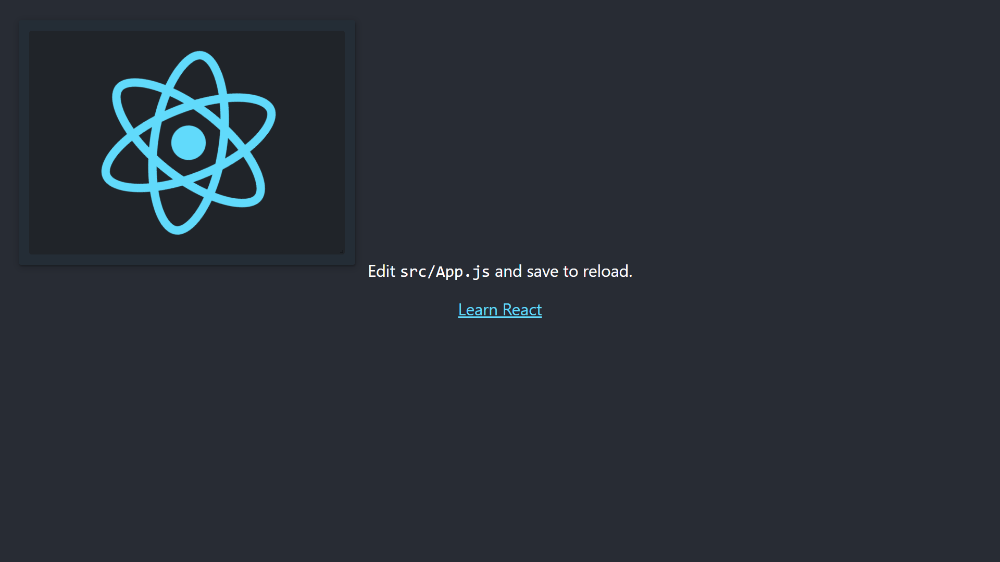

# Resizable-PIP

A resizable picture-in-picture component for React.

```js
<ResizablePIP>
  <div>I can be resized and moved around!</div>
</ResizablePIP>
```



### Installing

```bash
$ npm install resizable-pip
```

### Usage

This package has two major exports:

- [`<ResizablePIP>`](/src/lib/components/ResizablePIP.jsx): A simple PIP component that can be resized and moved around.
- [`<PIP>`](/src/lib/components/PIP.jsx): A simple PIP component that does not receive props and cannot be resized. Used as a base for the ResizablePIP component.

## `<ResizablePIP>`

A `<ResizablePIP>` element wraps an existing element and extends it with the ability to be resized and moved around, above all content in the app.

### ResizablePIP Usage

View the [source](/src/lib/components/ResizablePIP.jsx) for more.

```js
import { ResizablePIP } from "resizable-pip";
import "./App.css";

function App() {
  return (
    <div className="App">
      <header className="App-header">
        <ResizablePIP
          width={500}
          heigt={500}
          minConstraints={[300, 300]}
          maxConstraints={[800, 800]}
        >
          <p>
            Lorem ipsum dolor sit amet, consectetur adipiscing elit, sed do
            eiusmod tempor incididunt ut labore et dolore magna aliqua. Ut enim
            ad minim veniam, quis nostrud exercitation ullamco laboris nisi ut
            aliquip ex ea commodo consequat. Duis aute irure dolor in
            reprehenderit in voluptate velit esse cillum dolore eu fugiat nulla
            pariatur. Excepteur sint occaecat cupidatat non proident, sunt in
            culpa qui officia deserunt mollit anim id est laborum.
          </p>
        </ResizablePIP>
      </header>
    </div>
  );
}

export default App;
```

#### `<ResizablePIP>` Props:

```js

//
// Props:
//
{
// Specifies initial PIP window width.
// Example: 600
// Default value: 500
width: number,

// Specifies initial PIP window height.
// Example: 600
// Default value: 500
height: number,

// Specifies the minimum size possible for the PIP window (width, height).
// Example: [100, 100]
// Default value: [300, 300]
minConstraints: [number, number]

// Specifies the maximum size possible for the PIP window (width, height).
// Example: [900, 900]
// Default value: [800, 800]
maxConstraints: [number, number]
}
```

### License

MIT
